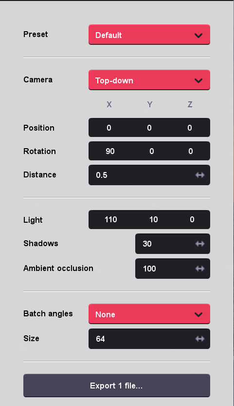
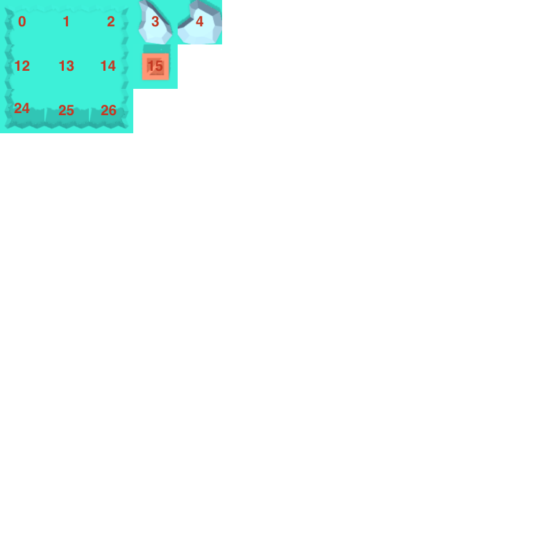

# 'nade it, Aaron!

## Map Assets

Map assets are generated using Asset Forge.

1. Assemble single tile using Asset Forge using the default grid. A single tile should span one grid cell.
2. Export as GLB file
3. Export as a sprite using the following export settings,
  
4. Paste exported sprite in final map grid (pixelmator file)
5. Update `tileReference.png` by exporting pixelmator file as PNG

## Tiles

Tile information is stored in `shared/mapdef.json`. The indices of the tiles directly correlate
the indices defined in the Tile Reference.

